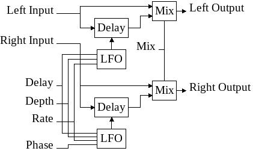

# yru-chorus-stereo-rs

## Overview

Stereo chorus with delay, depth, rate, phase and mix parameters. The
following diagram give an overview of how it works :

## Parameters

 - **delay:** average delay in millisecond applied on the wet signal. Low delay
   with high depth produce a flanger like sound.
 - **depth:** amplitude of the modulation. The modulation amplitude
   also depends on delay, so increasing the delay also increase the modulation
   amplitude.
 - **rate:** modulation speed in hertz.
 - **phase:** phase added to the right channel LFO. This allow to control the
   width of the stereo effect.
 - **mix:** balance between dry and wet signal. Use a fully wet mix to
   transform the chorus into vibrato.

## Technical notes

The delay line use linear interpolation, otherwise, an unaesthetic noise can be
heard.

At this time, i order to keep code simple, i don't use smoothing methods when
an input control change, but this may change... or not.
