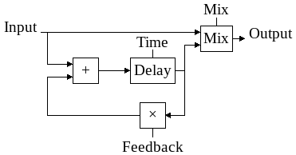

# yru-echo-rs-stereo

Basic echo with delay feedback and mix parameters. The _echo block diagram_
give an overview of how it works for one channel. The treatment is the same
for left and right channel.

At this time, i order to keep code simple:
- no smoothing when tweaking parameters
- no taped delay efect when change delay value
- no subsample delay precision, the delay is truncated to the corresponding
  number of samples.

But this may change... or not.
