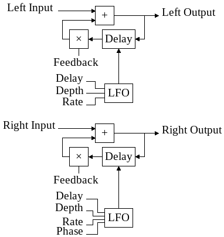

# yru-flanger-stereo-rs

## Overview

Basic stereo flanger. The flanger stereo block diagram give an overview of how
it works. On this diagram, wires with same name represent same signal.

## Parameters

 - **delay:** average delay in millisecond applied on the wet signal. This
   value affect "color" of the filter
 - **depth:** amplitude of the modulation. The modulation amplitude
   also depends on delay, so increasing the delay also increase the modulation
   amplitude.
 - **rate:** modulation speed in hertz.
 - **phase:** phase between LFOs in degrees, also referred as _spread_ (in
   percent).
 - **feedback:** also known as _regeneration_. It control the amount of signal
   injected back in the delay line.
   - affect intensity of the filter effect.
   - positive and negative feedback give a different "color".

## Technical notes

The delay line use linear interpolation, otherwise, an unaesthetic noise can be
heard.

At this time, i order to keep code simple, i don't use smoothing methods when
an input control change, but this may change... or not.
