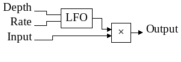

# yru-tremolo-rs-mono

## Overview
Basic tremolo with only depth and rate parameters. The _tremolo block diagram_
give an overview of how it works : it's an LFO modulating the
signal amplitude.

## Parameters
 - **Depth:** amplitude of the modulation.
 - **Rate:** modulation speed in hertz.

## Technical notes

At this time, i order to keep code simple, i don't use smoothing methods on
input controls. But this may change... or not.
